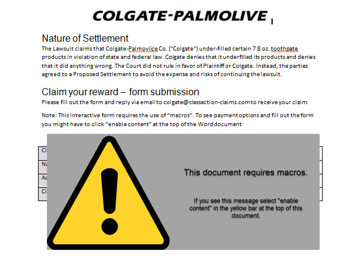
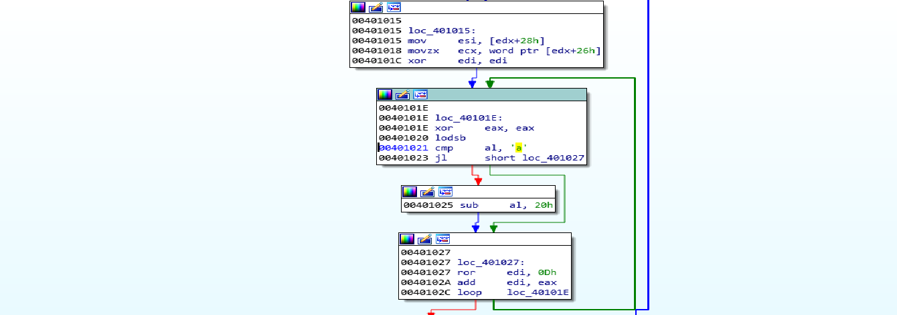
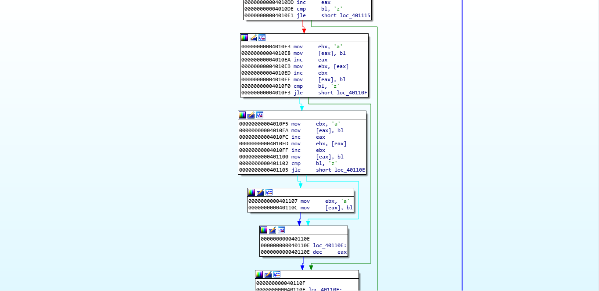
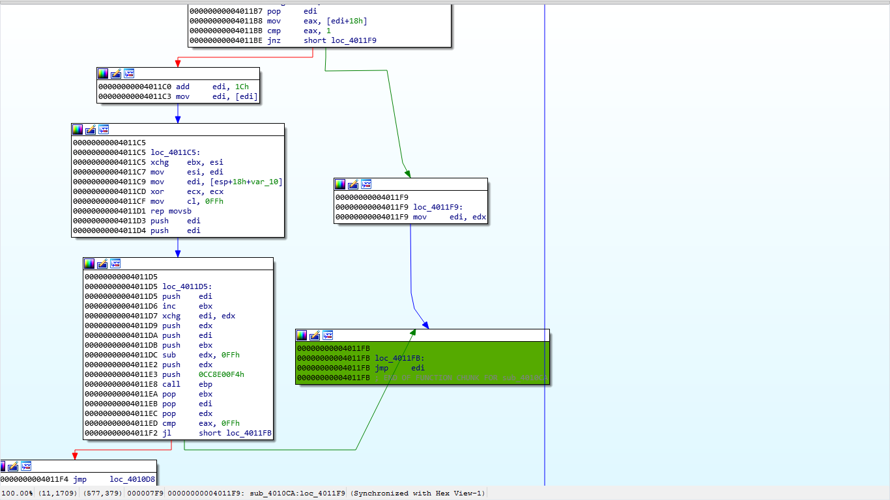

# Basic Information:

|**Name:**|**PT_MalDoc_SharpShooter_Lazarus**|
|:-:|:-:|
|**sha256:**|**dd38e5378f0de8489c9d015758d8ad390ecdf9599b8a4b90b218f6de6d1c1e16**|
|**FileType:**|**Composite Document File**|
|**FileExtension:**|**Microsoft Office File**|

# Introduction:

The sample is a **Composite Document**, having Colgate class action lawsuit as the subject.
Compound Document file is also known as Compound File Binary Format. It is a text or binary file format used for storing documents on a storage media, especially to be used by computer. It is like a container with very little restriction on what can be stored within it.
When we open the malicious file in MS Word we see a document having information on the settlement of a lawsuit against Colgate, it contains instructions to claim the settlement money and instructs the user to fill a form but in order to do that user needs to enable the macros.

Although enabling macros message is generally considered to be a malicious indicator but in such documents which involves filling up forms it is common to request the users to enable the macros.

# Strings:

When we analyzed the strings of this document we saw calls to some of the  windows API's and a VBA(Visual Basic Application) script which we will analyze later.

There was also a huge string in the file which looked like a base64 encoded string, we will check if this string is being decoded and used by the malicious section of the document later.

# Macros:

Once we extracted the macros from the malicious file we got 2 macros having names **NewMacros** and **ThisDocument**.

After Analyzing the NewMacros file we found out that it was the same VBA script that we found in the strings section and when the **OK**  button is pressed(to enable macros) in the MS-Word viewer, the **AutoOpen()** sub is executed and if the document is opened in Ms-Excel **WorkBook_open()** sub is executed on enabling macros. Both AutoOpen() and Workbook_Open() sub executes the **Auto_Open()** sub which contains the main script.

Inside Auto_Open() sub we noticed that an integer array (a shell code) is assigned to **myArray**.

Then there is a check for the length of **(Environ("ProgramW6432")  > 0 )** if the check return true then **sProc** is set to "**\\SysWOW64\\rundll32.exe**", otherwise it is set to "**\\System32\\rundll32.exe**".

RunStuff function is used to create a process having name **rundll32.exe** (which it takes from sproc). Then AllocStuff function is used to allocate space in the rundll32 process having the size that of the shellcode which is stored in myArray.

WriteStuff writes the shellcode byte by byte in the memory of rundll32.exe and finally CreateStuff creates a thread which accesses the same memory as that of rundl32.exe thus executing the shellcode.

# Shellcode Analysis:

The shellcode that was initialized to **myArray** in the VBA script had integer values. Therefore we converted the integer array to its equivalent byte array.

After converting the shell code to byte array we can see a unique string "**aaa.stage.15914547.tunnelcs.fax-email.us**", therefore it would be safe to assume that this domain name will be used in some way or the other by the shellcode.
We analyzed the shell code after converting it to an executable using an exe wrapper and found out that there is a loop which is used to find location of kernel32.dll to load all the necessary API calls that will be required to execute the shellcode.

There is another loop which keeps on incrementing the value of ebx register and there are three compare statements (**cmp bl, 'z'**) which compares the lower bytes of ebx register with 'z'.

Initially the value of ebx register is ”**aaa.stage.15914547.tunnelcs.fax-email.us**“ then as the loop iterates the value keeps on incrementing until “**zzz.stage.15914547.tunnelcs.fax-email.us**” is reached and sends DNS request to each domain name.
There is a function which checks the return value of the DNS request, It compares the 0x18 byte of the DNS return buffer with 0x1.

If the compare statement is satisfied then the domain name is incremented by one and if it fails then it means that the DNS return buffer is a malicious payload sent by the author, therefore the payload is moved to edi register and executed using the **jump edi** instruction.

After going through the entire shell code we found out that it is a modified version of metasploit script used for DNS TXT Record Payload Download and Execution ([link](https://github.com/rapid7/metasploit-framework/blob/master/modules/payloads/singles/windows/dns_txt_query_exec.rb)).

# Summary:

We found out that this malicious Microsoft document has an embedded VBA script which injects the shell code into rundll32.exe and executes it. The shellcode itself is a modified version of  a metasploit script and is used to perform TXT query against a series of DNS records to build a connection with the author and once the connection is established it executes the payload which is returned by the author.