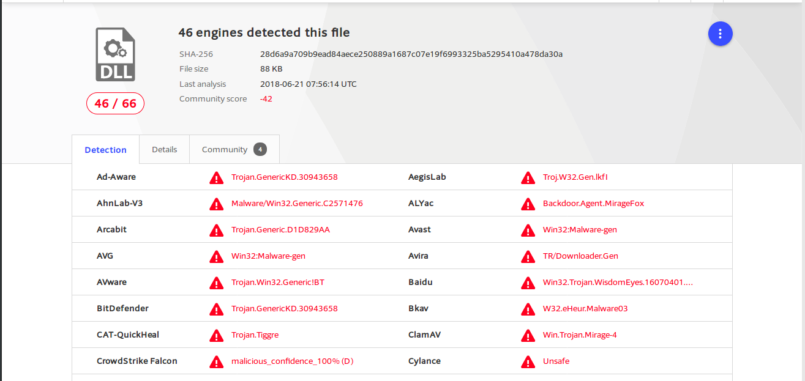
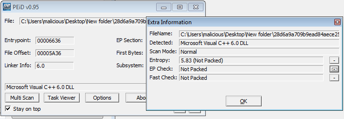
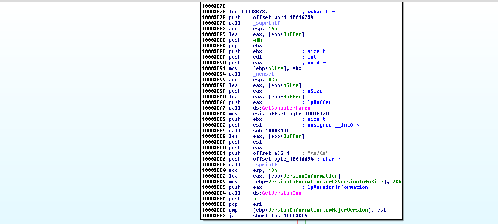
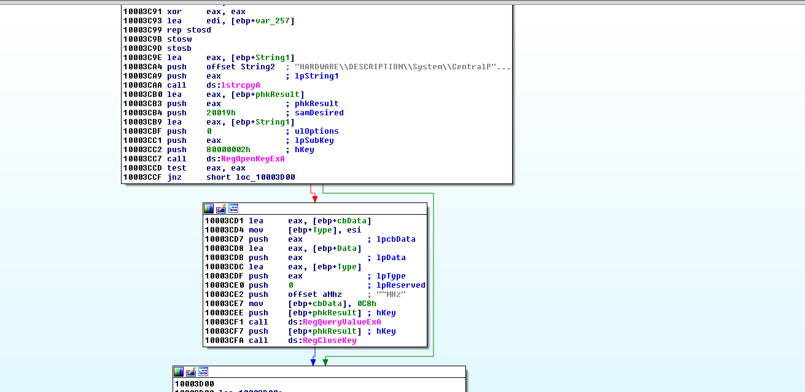
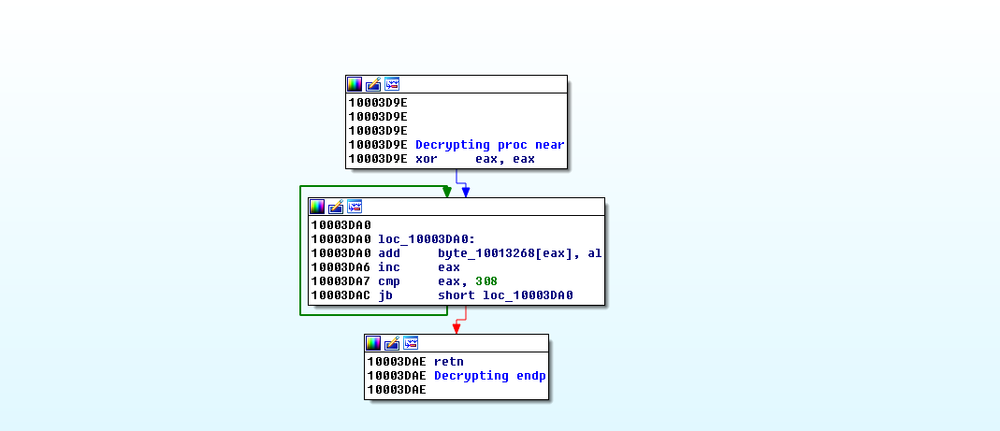
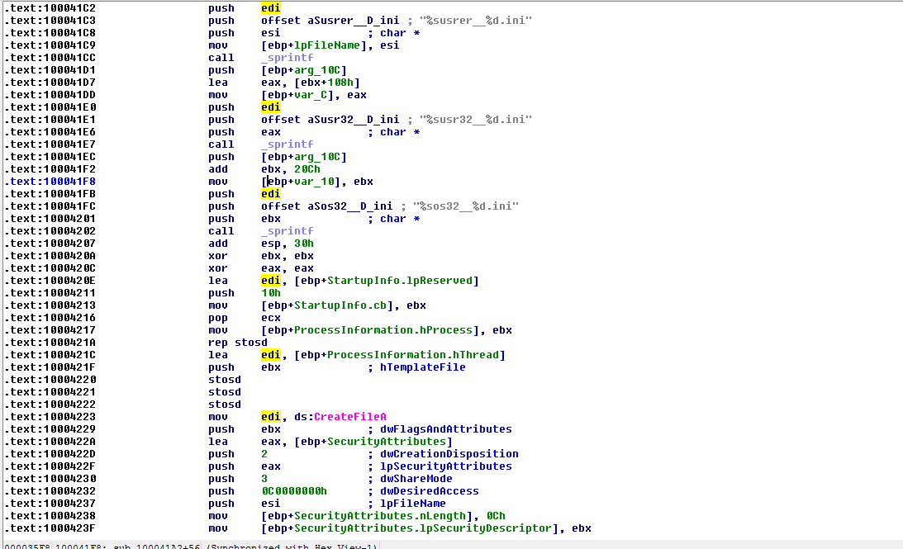

# History:
The **APT15** (**Aka Mirage, Royal APT**, **Playful Dragon** .. ) group has been active since at least 2010, They conducted cyber espionage campaigns against targets in defense, high tech, energy, government, aerospace, manufacturing industries worldwide. The attackers demonstrated an increasing level of sophistication across the years, they used a custom-malware and various exploits in their attacks.

# Basic Properties:

The version of APT15 malware that we have used in this report( SHA256: **28d6a9a709b9ead84aece250889a1687c07e19f6993325ba5295410a478da30a**) is called MirageFox.

# Detections:
According to the report by Virus Total the detection rate of this sample is 46/66.

As we can see in the below in the image, DLL is neither packed nor obfuscated.

# Analysis:
### Exports:

First we analyzed the exports of this DLL and found out that there are there are only 2 exports: **dll_wWinMain** and **DllEntryPoint**.

### Export Directory:

Probably the reason of naming this malware MirageFox rather than Mirage is due to the name in  export directory field which is **MirageFox_Server.dat**.

### Checking System Configurations:
The following function is  used to check the Internet settings.

**Sub_10003B1E** uses **GetComputerNameA** to retrieve the NetBIOS name of the local computer and **GetVersionExA** is used to retrieve the operating system version and both the information is stored in a buffer.

Later in the same function it is checked whether the Operating System running is 32bit or not by opening “**HARDWARE\\\DESCRIPTION\\\System\\\CentralProcessor\\\0**″ registry. If the registry opens then it means that it is a 32bit Operating System.
Then further in the same function processor details is also stored in a buffer.

# Decryption:
**sub_1003DA0** decrypts data stored in byte array **byte_10013268**.

After we manually decrypt the data in **byte_10013268**,we found the IP address of C&C(Comand and Control), port number, sleep timer, signature for identification and name of a DLL.

**IP C&C**: **192.168.0.107**

**Port**: **80**

**SleepTime** : **30000**

**Identification Signature**: **Mirage**

If we look at the IP Address carefully we can notice that **192.168.0.107** is an internal IP Address. It does not make sense but if we look at other APT-15 attacks, they are known for stealing VPN keys of the attacked system to communicate with the C&C for getting instructions. So we can assume that in this case the author already has the access to the keys and this DLL is used to communicate with the C&C.

# Shell Execution:

**Sub_10041A2** is used to execute the remote shell in the system based on the arguments passed by the C&C. This function is used to execute cmd.exe using a call to **CreateProcessA**.

# Summary:

We can now say that this Malware is used to attack a particular organization as it saves the Operating system version, Architecture, processor details and Internet Settings. it also tries to communicate to an Internal IP and sends all the saved information about the system to C&C and waits for instructions and opens a backdoor. C&C is responsible for sending the arguments for remote shell execution. It has the functionality to create processes and files, modify files, terminate itself and many more.